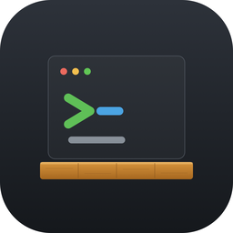
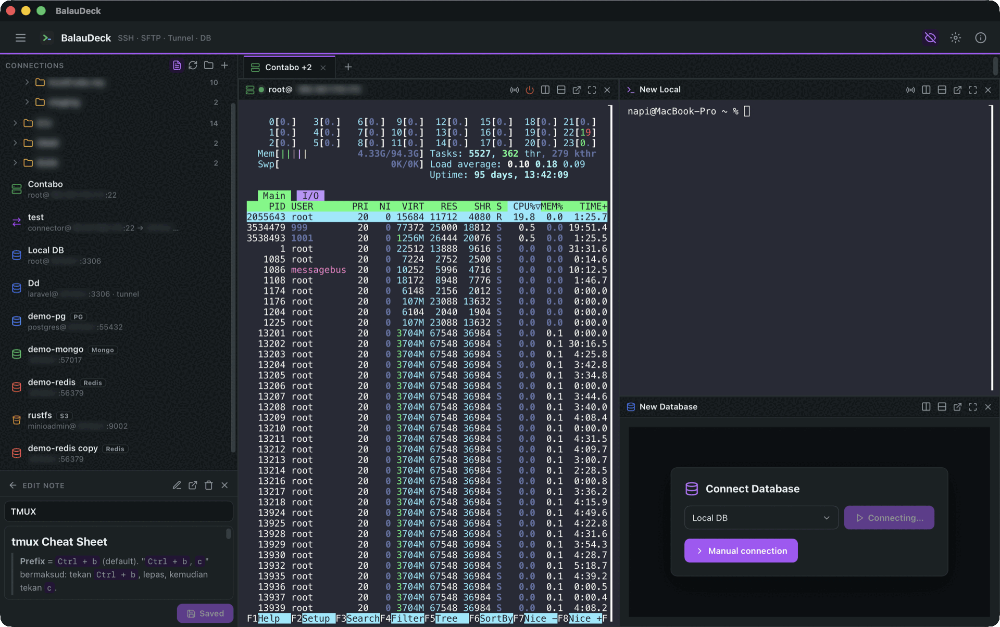
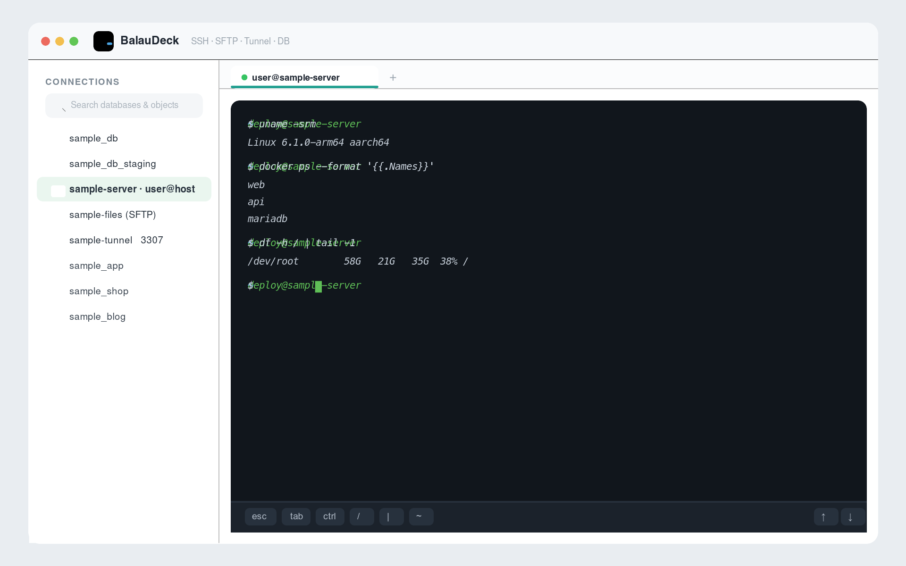
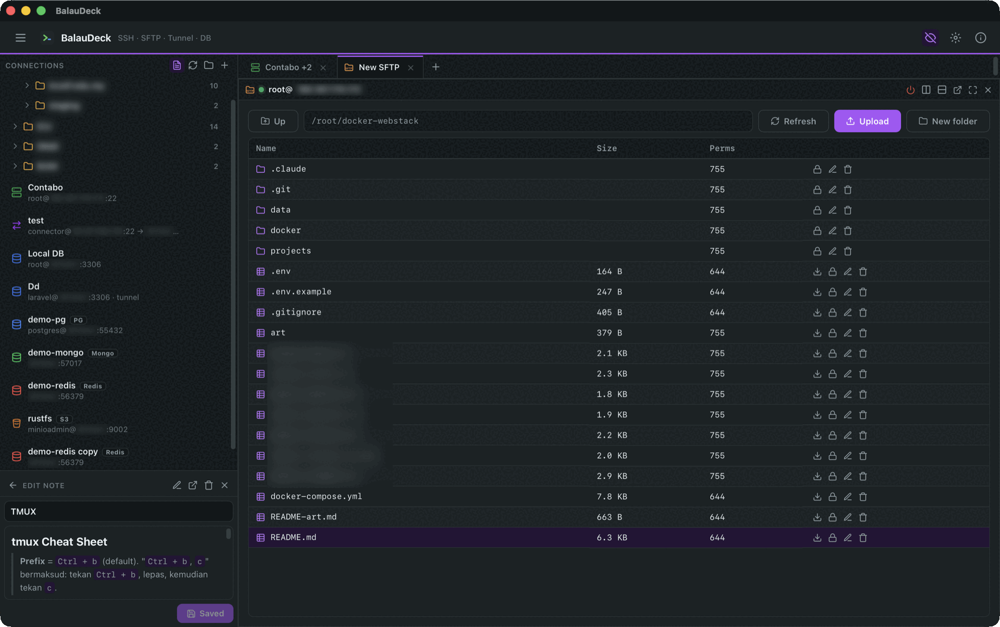
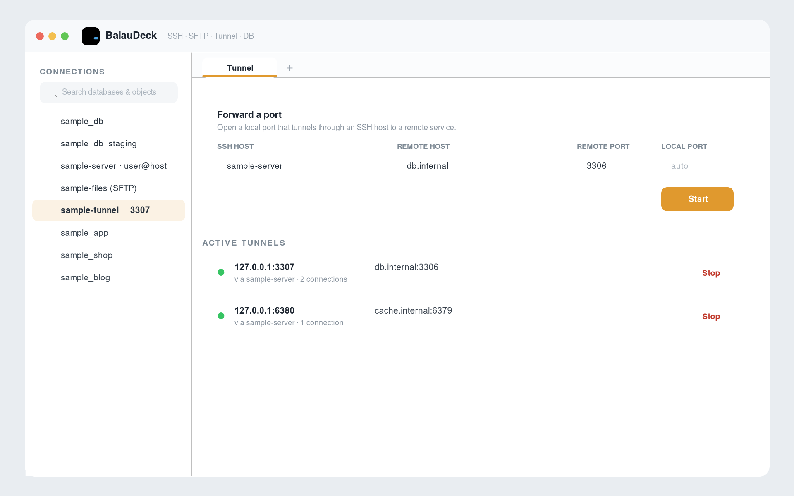

<p align="center">
  
</p>

<h1 align="center">BalauDeck</h1>

<p align="center">
  <a href="https://apps.apple.com/my/app/balaudeck/id6782116564"></a>
  <a href="https://play.google.com/store/apps/details?id=com.okdii.balaudeck"></a>
  <a href="https://github.com/okdii/balaudeck/releases/latest"></a>
</p>

All-in-one SSH + database client (Tauri 2). SSH terminal, SFTP, SSH tunneling,
and a MySQL/MariaDB client — one codebase for **iPad/iOS, macOS, Windows, and
Android**.

> Status: **shipping.** SSH terminal, SFTP, SSH tunneling, MySQL/MariaDB client,
> saved profiles + keychain, biometric app lock, encrypted cross-device sync,
> split-pane tabs, and Markdown notes. Live on the **App Store** (iPhone · iPad ·
> Mac), rolling out on **Google Play** (Android), with **Windows · macOS · Linux**
> installers on every [GitHub Release](https://github.com/okdii/balaudeck/releases/latest).

## Download

### App stores

<p>
  <a href="https://apps.apple.com/my/app/balaudeck/id6782116564">
    
  </a>
  &nbsp;
  <a href="https://play.google.com/store/apps/details?id=com.okdii.balaudeck">
    
  </a>
</p>

- **iPhone · iPad · Mac** — [App Store](https://apps.apple.com/my/app/balaudeck/id6782116564)
- **Android** — [Google Play](https://play.google.com/store/apps/details?id=com.okdii.balaudeck)

### Desktop installers

Built by GitHub Actions ([`release.yml`](.github/workflows/release.yml)) and attached to every
**[GitHub Release](https://github.com/okdii/balaudeck/releases/latest)** — pick the file for your
platform from the latest release assets:

| Platform | Installer |
|---|---|
| 🪟 **Windows** | [`.msi`](https://github.com/okdii/balaudeck/releases/latest) · [NSIS `-setup.exe`](https://github.com/okdii/balaudeck/releases/latest) |
| 🍎 **macOS** (Apple Silicon) | [`.dmg`](https://github.com/okdii/balaudeck/releases/latest) |
| 🐧 **Linux** | [`.deb`](https://github.com/okdii/balaudeck/releases/latest) · [`.rpm`](https://github.com/okdii/balaudeck/releases/latest) · [`.AppImage`](https://github.com/okdii/balaudeck/releases/latest) |
| 🤖 **Android** | [Google Play](https://play.google.com/store/apps/details?id=com.okdii.balaudeck) · `.apk` for sideloading is attached to tagged [releases](https://github.com/okdii/balaudeck/releases) |

Desktop and APK builds are **not code-signed** — on first launch choose **Windows SmartScreen →
More info → Run anyway**, **macOS right-click → Open**, or enable “install unknown apps” on Android.
iOS/iPadOS build from source (see [Run](#run)).

## Preview

A real session — split panes running an SSH terminal (`htop`), the MySQL/MariaDB client, and a
second SSH shell, with tabs and per-pane tools (IPs and database name blurred):



More screens:

**SSH terminal** — interactive PTY shell with the iPad keyboard accessory bar



**SFTP browser** — remote files with sizes, dates and permissions



**SSH tunnels** — forward a local port and manage active tunnels



## Stack
- **Core (Rust):** `russh` (SSH/PTY/tunnel), `russh-sftp`, `mysql_async` (DB),
  `keyring` (secrets; file-backed store on Android), `aes-gcm` + `argon2`
  (encrypted backup bundle), `tokio`.
- **Frontend:** React + TypeScript + Vite, `xterm.js` terminal, CodeMirror SQL editor.
- **Shell:** Tauri 2.

## Prerequisites
- **Node 22** via nvm — `nvm use` (an `.nvmrc` pins it). Node 16 is too old.
- Rust stable, Xcode (for iOS), CocoaPods.

## Run
```bash
nvm use
npm install

# Desktop (macOS/Windows/Linux)
npm run tauri dev

# iPad / iOS simulator
npm run tauri ios dev "iPad Pro 13-inch (M5)"

# iOS device (signed): build a debug .ipa, then install with devicectl
npm run tauri -- ios build --export-method debugging

# Android device over Wi-Fi: build + install + launch in one step
npm run android:wifi -- --build   # omit --build to reinstall the last APK
```

`scripts/android-wifi-install.sh` connects to the phone over Wi-Fi (no USB),
auto-discovering the current wireless-debugging port via mDNS if it changed.
Set `BALAUDECK_ANDROID_IP` if DHCP moved the device.

## Test target (local)
The `docker-webstack-baru` stack runs MariaDB for testing:
- host: `127.0.0.1` (simulator reaches the host via localhost), port `3306`
- user `root`, password `12345` (dev default) — or `webstack`/`webstack`, db `webstack`

## Layout
- `src-tauri/src/ssh.rs` — SSH connect + interactive shell, streamed via
  `ssh://data/<id>` events. Commands: `ssh_open_shell`, `ssh_write`,
  `ssh_resize`, `ssh_close`.
- `src-tauri/src/db.rs` — `db_query` (streamed columns/rows), `db_exec_batch`
  (transactional row edits), schema objects, dump/import over mysql_async.
- `src-tauri/src/sftp.rs` — SFTP transfers and file ops (incl. `sftp_chmod`).
- `src/SshPanel.tsx` — xterm terminal wired to the SSH commands.
- `src/DbPanel.tsx` — schema sidebar, SQL editor, results grid, data editing,
  and the table designer.

## Features
- **Saved profiles** (SSH / SFTP / tunnel / database) in the sidebar, organized
  into folders; secrets live in the OS keychain, never on disk. Selecting a
  profile connects without retyping.
- **SSH terminal** — interactive PTY shell (xterm.js), password & public-key
  auth, TOFU host-key verification, iPad keyboard accessory bar.
- **SFTP browser** — browse, streamed upload/download (native file dialog),
  rename, delete, mkdir, and **change permissions** (chmod, rwx grid + octal).
  Connect using a saved SSH host, and optionally **run the server elevated**
  (`sudo /usr/lib/openssh/sftp-server`, with a stored sudo password or NOPASSWD)
  to browse as root. The title bar shows the effective `user@host`.
- **SSH tunnels** — local port forwarding; databases can connect through a tunnel.
- **MySQL/MariaDB client**
  - Schema sidebar (databases → tables / views / functions / saved queries) with
    a **search** box; connection-pool reuse.
  - SQL editor with **syntax highlighting**, beautify/minify, adjustable height,
    saved queries, and a virtualized results grid with a row cap.
  - **Edit data inline** — double-click a cell to edit; changes are written back
    as parameterized, transactional `UPDATE`s keyed on the primary key.
  - **Table designer** — create/alter columns, types, indexes, and foreign keys;
    plus **Show DDL**, create database, and **export / import SQL** with progress.
- **Full-screen panes** — maximize any pane (SSH / SFTP / tunnel / DB) to fill the
  whole display (the OS window goes fullscreen on desktop); the header toolbar
  stays visible so you can restore the original split layout.
- **Cross-device sync** — export all profiles **and their secrets** as one
  encrypted, passphrase-protected bundle (AES-256-GCM, key derived via Argon2id)
  and import it on another device, so Mac, iPhone, iPad and Android share the same
  connections. Move it via AirDrop / Universal Clipboard / Files; desktop also
  saves/loads a `.balaudeck` file. Import merges by id and prunes dangling
  references.
- **Touch-first** — resize handles, toolbars and row actions work with touch
  (Pointer Events) on iPad and Android tablets, with larger touch targets.
- **Biometric app lock** (Face ID / Touch ID / device credential) on launch and
  after the app has been backgrounded past a short grace period (mobile). Quick
  interruptions (file picker, app switch) don't re-prompt.

## Releasing to TestFlight / App Store (iOS)
Requires an Apple Developer account and a signing team.
```bash
# Build a signed release archive (set your team)
npm run tauri ios build -- --export-method app-store-connect
```
Then upload the resulting `.ipa` via Xcode Organizer or `xcrun altool`/Transporter.
Notes:
- `NSFaceIDUsageDescription` is set in `gen/apple/balaudeck_iOS/Info.plist`.
- `gen/apple/balaudeck_iOS/PrivacyInfo.xcprivacy` declares the privacy manifest;
  ensure it is a member of the app target's *Copy Bundle Resources* in Xcode.
- Raw SSH/MySQL sockets are not HTTP, so ATS exceptions are not required.
- Encryption: the app uses only standard AES (backup bundle) + TLS/SSH, so set
  `ITSAppUsesNonExemptEncryption` and claim the standard-crypto exemption.

## Desktop bundles (macOS / Windows)
```bash
npm run tauri build            # current OS bundle
# macOS: .app + .dmg (notarize separately for distribution)
# Windows (run on Windows): .msi / NSIS .exe
```
The keychain backend is selected per OS at compile time (macOS/iOS Keychain,
Windows Credential Manager, Linux Secret Service). Android has no keyring backend,
so secrets are kept in the app's private storage (`allowBackup="false"`);
encrypting that file with the Android Keystore is a planned hardening step before
any public Play Store release.

See the full roadmap (Fasa 0–9) in the plan file referenced in the project notes.

## License

BalauDeck is open source under the [MIT License](LICENSE) — © 2026 Okdii
Solutions. You're free to use, modify, and distribute it; the software is
provided "as is", without warranty.
